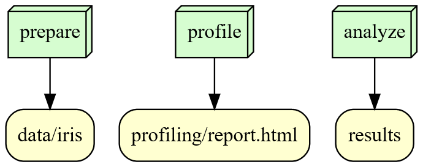

# is477-fall2023-final-project
  
Final Project for IS477
## Overview
Iris is one of the earliest datasets used for evaluating classification methods. The dataset has widely been used in statistics and machine learning.  

The data set contains 3 classes of 50 instances each, and each class represents a type of iris plant.  

I computed all three classes' average values of sepal length, sepal width, petal length, and petal width. To show the distributions and relations, I made scatter plots for each type of plant. The scatter plots show the relations between sepal length & width and petal length & width. It also shows the distributions of the values.

## Analysis
For the average values:  
Setosa:  sepal length:5.004, sepal width:3.416, petal length:1.465, petal width:0.245  
Versicolor:  sepal length:5.936, sepal width:2.77, petal length:4.26, petal width:1.326  
Virginica:  sepal length:6.588, sepal width:2.974, petal length:5.552, petal width:2.026  
These types of plants have similar sepal length, sepal width, and pedal width values. However, their petal length values are not close to each other. Setosa only has an average petal length of 1.465, while Versicolor has an average value of 4.26 and it is 5.552 for Virginica  

For the distribution: Samples have relatively great ranges of distribution. Lengths and widths are roughly positively correlated.

## Workflow

The output for "rule prepare" is a directory "data/iris". While "rule profile" and "rule analyze" only use "iris.data" in the directory to do analysis. The output for "rule profile" is "profiling/report.html" and the output for "rule analyze" is "results"

## Reproducing
* Activate the virtual environment using "source .venv/Scripts/activate"
* Run "pip install -r requirements.txt" to obtain all dependencies (Note: You'll have to download Visual C++ Build Tools before installing Snakemake)
* Run the workflow using snakemake

## License
MIT License

Copyright (c) 2023 Kejing Xu

Permission is hereby granted, free of charge, to any person obtaining a copy
of this software and associated documentation files (the "Software"), to deal
in the Software without restriction, including without limitation the rights
to use, copy, modify, merge, publish, distribute, sublicense, and/or sell
copies of the Software, and to permit persons to whom the Software is
furnished to do so, subject to the following conditions:

The above copyright notice and this permission notice shall be included in all
copies or substantial portions of the Software.

THE SOFTWARE IS PROVIDED "AS IS", WITHOUT WARRANTY OF ANY KIND, EXPRESS OR
IMPLIED, INCLUDING BUT NOT LIMITED TO THE WARRANTIES OF MERCHANTABILITY,
FITNESS FOR A PARTICULAR PURPOSE AND NONINFRINGEMENT. IN NO EVENT SHALL THE
AUTHORS OR COPYRIGHT HOLDERS BE LIABLE FOR ANY CLAIM, DAMAGES OR OTHER
LIABILITY, WHETHER IN AN ACTION OF CONTRACT, TORT OR OTHERWISE, ARISING FROM,
OUT OF OR IN CONNECTION WITH THE SOFTWARE OR THE USE OR OTHER DEALINGS IN THE
SOFTWARE.

## References
Fisher,R. A.. (1988). Iris. UCI Machine Learning Repository. https://doi.org/10.24432/C56C76.